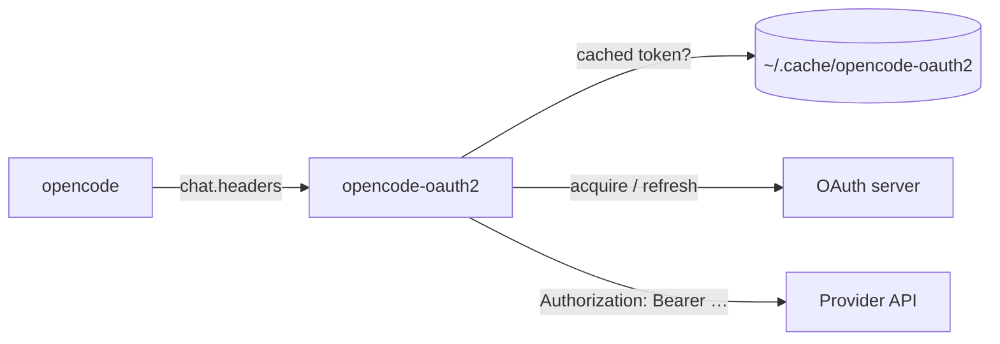

# opencode-oauth2

> Bring your own OAuth-protected LLM gateway to [OpenCode](https://opencode.ai).

An [OpenCode](https://opencode.ai) plugin that lets you wire up **OpenAI-compatible model providers sitting behind OAuth2 / OIDC** — without baking long-lived API keys into your config. Discover models dynamically, refresh tokens automatically, and let OpenCode talk to your gateway as if it were any other provider.


---



## Why

Most OpenCode providers assume a static bearer key. That works for hosted SaaS, but breaks down the moment you put your models behind:

- a corporate Identity Provider (Keycloak, Auth0, Okta, Azure AD, …)
- a self-hosted gateway with short-lived tokens
- a multi-tenant setup where each user authenticates as themselves
- a CI runner that has no business carrying a long-lived secret

This plugin closes that gap. It handles the OAuth dance for the flow you need, caches tokens, refreshes silently, and feeds OpenCode a normal-looking provider with a fresh `Authorization` header on every request.

## Features

- **Five auth flows**, pick what matches your runtime:
  - `authorization_code` — interactive PKCE login (default)
  - `device_code` — RFC 8628, for browserless user auth
  - `client_credentials` — machine-to-machine with a `clientSecret`
  - `jwt_bearer` — RFC 7523 federated identity (GitHub Actions OIDC, Kubernetes SA tokens) — **no long-lived secret in CI**
  - `token_exchange` — RFC 8693 federated identity with explicit audience targeting
- **Dynamic model discovery** from `/v1/models` (no hand-maintained model lists)
- **Display-name normalization** so `glm-5` shows up as `GLM 5`
- **Persistent token cache** with automatic refresh
- **`chat.headers` hook** injects bearer tokens per request
- **Two configuration styles**: per-provider options or a top-level plugin block

## Install

```jsonc
{
  "$schema": "https://opencode.ai/config.json",
  "plugin": ["@vymalo/opencode-oauth2"]
}
```

Then declare a provider:

```jsonc
{
  "plugin": ["@vymalo/opencode-oauth2"],
  "provider": {
    "example-ai": {
      "name": "Example AI",
      "options": {
        "baseURL": "https://api.example.com/v1",
        "oauth2": {
          "issuer": "https://auth.example.com",
          "clientId": "opencode-client",
          "scopes": ["openid", "profile", "offline_access"],
          "syncIntervalMinutes": 60
        }
      }
    }
  }
}
```

See [packages/opencode-oauth2/README.md](packages/opencode-oauth2/README.md) for the **full configuration reference** (including the alternative `pluginConfig.oauth2ModelSync.servers` layout and every optional field).

## Documentation

| Page | When you need it |
| --- | --- |
| [`docs/architecture.md`](docs/architecture.md) | Understand the hooks, token lifecycle per flow, cache layout, sync scheduler, logging |
| [`docs/models-info.md`](docs/models-info.md) | The companion metadata-enrichment plugin — how it composes with any auth scheme, caching, failure modes |
| [`docs/github-actions.md`](docs/github-actions.md) | CI without stored secrets — Keycloak/Auth0/Okta setup, reusable workflow, matrix, fork-PR limits |
| [`docs/kubernetes.md`](docs/kubernetes.md) | `CronJob` / `Job` / `Deployment` with projected SA tokens, multi-provider pods, RBAC |
| [`docs/local-development.md`](docs/local-development.md) | Sandbox setup, plugin re-export trick, forcing re-auth, dev-only `env` subject token |
| [`docs/troubleshooting.md`](docs/troubleshooting.md) | Symptom-keyed fixes — `redirect_uri_mismatch`, model discovery 403, `invalid_client`, projected-token rotation |

## Companion plugin: model metadata

This workspace also ships [`@vymalo/opencode-models-info`](packages/opencode-models-info) — a separate, **auth-agnostic** plugin that enriches your model entries with full metadata (context length, output limit, USD/M-token cost, modalities, and `tool_call` / `reasoning` / `attachment` flags).

`meta.modelsInfoUrl` is **the HTTP(S) endpoint that returns the metadata JSON** — `{ "data": [ { "id", "context_length", "pricing", … } ] }`. Point it at your provider's metadata endpoint (an absolute URL, or a path resolved against `baseURL`):

```jsonc
{
  "plugin": ["@vymalo/opencode-models-info"],
  "provider": {
    "my-provider": {
      "npm": "@ai-sdk/openai-compatible",
      "options": {
        "baseURL": "https://api.example.com/v1",
        "meta": { "modelsInfoUrl": "https://api.example.com/v1/models" }
      },
      "models": { "my-model-large": {} }
    }
  }
}
```

The expected JSON is commonly called the **OpenRouter shape** (it's what OpenRouter's `/models` returns), but the plugin has no dependency on OpenRouter — any endpoint serving that shape works. A plain OpenAI-compatible `/v1/models` returns sparse data (`id`, `object`, `owned_by`) — *not* `context_length` / `pricing` — so the endpoint must actually carry the richer fields.

It doesn't depend on the oauth2 plugin — it runs as a `config` hook *after* other plugins, composing with oauth2, static API keys, or no auth. When paired with `@vymalo/opencode-oauth2` ≥ 0.4.0, an OAuth2-protected metadata endpoint works with zero extra config: the oauth2 plugin stamps the cached bearer onto the provider's headers at config time and the metadata fetch inherits it.

### Both plugins together

One provider, authenticated by oauth2 and enriched by models-info. List `@vymalo/opencode-oauth2` **first** so its `config` hook runs before models-info and the bearer is already in place when the metadata fetch happens:

```jsonc
{
  "plugin": ["@vymalo/opencode-oauth2", "@vymalo/opencode-models-info"],
  "provider": {
    "my-provider": {
      "npm": "@ai-sdk/openai-compatible",
      "options": {
        "baseURL": "https://api.example.com/v1",
        "oauth2": {
          "issuer": "https://auth.example.com",
          "clientId": "opencode-client",
          "scopes": ["openid", "profile", "offline_access"]
        },
        "meta": { "modelsInfoUrl": "https://api.example.com/v1/models" }
      }
    }
  }
}
```

What happens on boot: oauth2 authenticates, discovers models from `/v1/models`, and stamps the access token onto the provider's headers; models-info then fetches `modelsInfoUrl` with that token and merges the richer metadata onto the discovered models. No `models` block needed — oauth2 populates it. No `Authorization` header to manage — it's automatic.

Full reference: [`packages/opencode-models-info/README.md`](packages/opencode-models-info/README.md). Behavior, caching, and composition details: [`docs/models-info.md`](docs/models-info.md).

## Federated identity (CI / Kubernetes)

For GitHub Actions and Kubernetes workloads, use `jwt_bearer` (or `token_exchange`) with the platform's own short-lived OIDC token as the subject. The plugin re-fetches it on every access-token expiry; nothing long-lived gets cached.

End-to-end recipes live in [`docs/github-actions.md`](docs/github-actions.md) and [`docs/kubernetes.md`](docs/kubernetes.md). The shipped reusable workflow at [`.github/workflows/opencode-run.yml`](.github/workflows/opencode-run.yml) covers the common `opencode run` case.

## Token Policy

Refresh tokens are **mandatory** for the flows that issue them.

- `authorization_code` / `device_code` exchanges that don't return `refresh_token` are rejected.
- Cached tokens missing `refreshToken` are evicted on load (unless they're from `client_credentials` / `jwt_bearer` / `token_exchange`, which don't issue one).
- Refresh responses that omit a new `refresh_token` re-use the existing one.

The intent: a user-flow session is either fully renewable or it doesn't get cached. Machine flows re-acquire on every expiry; refresh tokens have no role there.

## Workspace Layout

This is a [pnpm](https://pnpm.io) monorepo.

| Package | Purpose |
| --- | --- |
| [`packages/opencode-oauth2`](packages/opencode-oauth2) | OAuth2/OIDC auth + model discovery — published as `@vymalo/opencode-oauth2` |
| [`packages/opencode-models-info`](packages/opencode-models-info) | Auth-agnostic model **metadata enrichment** — published as `@vymalo/opencode-models-info` |
| [`packages/plugin-bundle`](packages/plugin-bundle) | Rolldown-based bundling for distribution |
| [`plans/prd.md`](plans/prd.md) | Product requirements and phased roadmap |

## Development

```sh
pnpm install
pnpm build
pnpm typecheck
pnpm test
```

Plugin-only iteration:

```sh
pnpm --filter @vymalo/opencode-oauth2 test
pnpm --filter @vymalo/opencode-oauth2 build
```

For end-to-end usage against a local OpenCode install, see [GETTING_STARTED.md](GETTING_STARTED.md).

## Status

Early but functional. The Phase 1 scaffold and Phase 2 runtime core are in; bundling (Phase 3) has landed. Public API may still shift before `1.0`.

Roadmap and phase breakdown live in [plans/prd.md](plans/prd.md).

## Contributing

Issues and PRs are welcome. Please open an issue first for substantial changes so we can align on scope before code review.

## License

[MIT](LICENSE) © vymalo contributors
