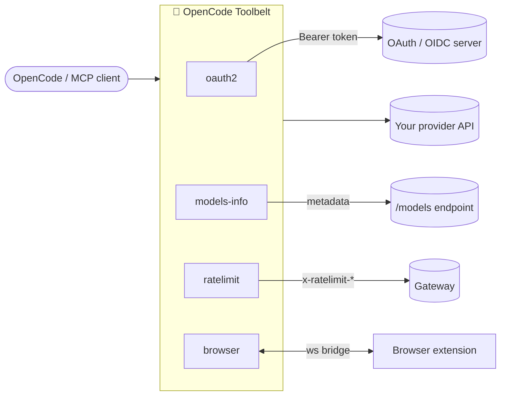

# 🧰 OpenCode Toolbelt

> Five small plugins that make [OpenCode](https://opencode.ai) feel like it's running on your own infrastructure — OAuth-secured providers, rich model metadata, polite rate-limiting, and hands in a real browser.

<p>
  <a href="https://github.com/vymalo/opencode-oauth2/actions/workflows/ci.yml"></a>
  <a href="LICENSE"></a>
  =22" src="https://img.shields.io/badge/node-%3E%3D22-339933?logo=node.js&logoColor=white">
  
  
  
</p>

<p>
  <a href="https://www.npmjs.com/package/@vymalo/opencode-oauth2"></a>
  <a href="https://www.npmjs.com/package/@vymalo/opencode-models-info"></a>
  <a href="https://www.npmjs.com/package/@vymalo/opencode-ratelimit"></a>
  <a href="https://www.npmjs.com/package/@vymalo/opencode-browser"></a>
  <a href="https://www.npmjs.com/package/@vymalo/opencode-browser-mcp"></a>
</p>

---

OpenCode is great at talking to providers — as long as your provider is a hosted SaaS with a static API key and a tidy `/v1/models` endpoint. The moment you put your models behind a corporate IdP, a self-hosted gateway, a per-window rate limit, or you want the model to actually *click around a web page*, you're on your own.

The **OpenCode Toolbelt** is the set of `@vymalo/*` plugins that fill those gaps. Each one is small, **auth-agnostic where it can be**, independently published, and does exactly one job. Reach for one, or snap several onto the same provider — they're designed to stack.

## What's in the belt

| 🔧 Tool | npm | What it does |
| --- | --- | --- |
| **oauth2** | [`@vymalo/opencode-oauth2`](packages/opencode-oauth2) | Wire up OpenAI-compatible providers sitting behind **OAuth2 / OIDC** — five auth flows, dynamic model discovery, a persistent token cache, and a fresh `Authorization` header on every request. No long-lived keys in your config. |
| **models-info** | [`@vymalo/opencode-models-info`](packages/opencode-models-info) | Enrich your model list with real **metadata** — context length, output limit, USD/M-token cost, modalities, and `tool_call` / `reasoning` / `attachment` flags — from any OpenRouter-shaped `/models` endpoint. |
| **ratelimit** | [`@vymalo/opencode-ratelimit`](packages/opencode-ratelimit) | Teach a provider to **respect the rate-limit headers** your gateway already sends. Reads Envoy / IETF draft-03 `x-ratelimit-*`, throttles before you hit the wall, and backs off + retries on `429`. |
| **browser** | [`@vymalo/opencode-browser`](packages/opencode-browser) | Give the model **hands in a real browser**: 34 `browser_*` tools (open, click, type, scroll, screenshot, snapshot, human-in-the-loop feedback…) over a localhost bridge that a companion extension drives. |
| **browser-mcp** | [`@vymalo/opencode-browser-mcp`](packages/opencode-browser-mcp) | The same browser tools, exposed as an **MCP stdio server** — so Claude Code, Cursor, Cline, and any other MCP client can drive the extension too. |
| 🧩 **extension** | [`apps/browser-extension`](apps/browser-extension) | The companion Chromium + Firefox extension that the browser plugin / MCP server talk to. Private — ships as a Release asset and on the Chrome Web Store / Firefox AMO. |



> [!TIP]
> Every plugin here works with **any** auth scheme — static API key, OAuth2, or none — *except* oauth2 itself, which is the one doing the authenticating. Enable only what you need.

> [!NOTE]
> The workspace also carries an **experimental, private** plugin — `@vymalo/opencode-code-index` (DuckDB + tree-sitter code indexing: `code_symbol`, `code_callers`, `code_blast_radius`, …). It is **not published**, not part of the five-plugin suite above, and may be removed. See [`docs/code-index.md`](docs/code-index.md).

## Quickstart

Add the plugins you want to your OpenCode config and declare a provider. The smallest possible setup — an OAuth2-protected provider that discovers its own models:

```jsonc
{
  "$schema": "https://opencode.ai/config.json",
  "plugin": ["@vymalo/opencode-oauth2"],
  "provider": {
    "example-ai": {
      "name": "Example AI",
      "options": {
        "baseURL": "https://api.example.com/v1",
        "oauth2": {
          "issuer": "https://auth.example.com",
          "clientId": "opencode-client",
          "scopes": ["openid", "profile", "offline_access"],
          "syncIntervalMinutes": 60
        }
      }
    }
  }
}
```

On boot, oauth2 runs the auth flow, caches the token, discovers your models, and OpenCode treats `example-ai` like any other provider. For the full configuration reference (every flow, every field, the alternative `pluginConfig.oauth2ModelSync.servers` layout), see [`packages/opencode-oauth2/README.md`](packages/opencode-oauth2/README.md).

> [!NOTE]
> The slickest way to ship this to a team is **not** an `opencode.json` at all — a server publishes a `.well-known/opencode` document and `opencode auth login <url>` adopts the provider + plugin setup automatically. See [`docs/well-known.md`](docs/well-known.md).

---

## 🔐 oauth2 — bring your own OAuth-protected gateway

Most OpenCode providers assume a static bearer key. That works for hosted SaaS, but breaks down the moment your models sit behind a corporate IdP (Keycloak, Auth0, Okta, Azure AD), a self-hosted gateway with short-lived tokens, a multi-tenant setup where each user authenticates as themselves, or a CI runner that has no business carrying a long-lived secret.

`@vymalo/opencode-oauth2` handles the OAuth dance, caches tokens, refreshes silently, and feeds OpenCode a normal-looking provider with a fresh `Authorization` header on every request.

- **Five auth flows** — pick what matches your runtime:
  - `authorization_code` — interactive PKCE login (default)
  - `device_code` — RFC 8628, for browserless user auth
  - `client_credentials` — machine-to-machine with a `clientSecret`
  - `jwt_bearer` — RFC 7523 federated identity (GitHub Actions OIDC, Kubernetes SA tokens) — **no long-lived secret in CI**
  - `token_exchange` — RFC 8693 federated identity with explicit audience targeting
- **Dynamic model discovery** from `/v1/models` — no hand-maintained model lists
- **Display-name normalization** so `glm-5` shows up as `GLM 5`
- **Persistent token cache** with automatic refresh, atomic writes, `0o600`
- **`chat.headers` hook** injects a fresh bearer per request
- **Strict refresh-token policy** — a user-flow session is either fully renewable or it doesn't get cached (machine flows re-acquire on every expiry)

**Federated identity (CI / Kubernetes):** use `jwt_bearer` or `token_exchange` with the platform's own short-lived OIDC token as the subject — nothing long-lived is ever cached. End-to-end recipes in [`docs/github-actions.md`](docs/github-actions.md) and [`docs/kubernetes.md`](docs/kubernetes.md); the shipped reusable workflow at [`.github/workflows/opencode-run.yml`](.github/workflows/opencode-run.yml) covers the common `opencode run` case.

## 📊 models-info — real metadata for your model list

A plain OpenAI-compatible `/v1/models` returns almost nothing useful (`id`, `object`, `owned_by`). `@vymalo/opencode-models-info` enriches each model with the rich stuff — context length, output limit, USD/M-token cost, modalities, and `tool_call` / `reasoning` / `attachment` flags — from any **OpenRouter-shaped** metadata endpoint.

```jsonc
{
  "plugin": ["@vymalo/opencode-models-info"],
  "provider": {
    "my-provider": {
      "npm": "@ai-sdk/openai-compatible",
      "options": {
        "baseURL": "https://api.example.com/v1",
        "meta": { "modelsInfoUrl": "https://api.example.com/v1/models" }
      },
      "models": { "my-model-large": {} }
    }
  }
}
```

It runs as a `config` hook **after** other plugins and the merge is **upstream-wins** — a field you (or another plugin) already set is never clobbered, so it's safe to enable globally. Full reference: [`packages/opencode-models-info/README.md`](packages/opencode-models-info/README.md); composition + caching details in [`docs/models-info.md`](docs/models-info.md).

## 🚦 ratelimit — cooperate with your gateway instead of fighting it

`@vymalo/opencode-ratelimit` makes a provider respect the rate-limit headers your gateway already emits. It reads the IETF draft-03 triple from [Envoy Gateway](https://gateway.envoyproxy.io/docs/tasks/traffic/global-rate-limit/) (`x-ratelimit-limit` / `-remaining` / `-reset`), proactively pauses new requests once the window is exhausted, and backs off + retries on `429` — so a burst cooperates with the gateway instead of earning a wall of errors.

```jsonc
{
  "plugin": ["@vymalo/opencode-ratelimit"],
  "provider": {
    "my-provider": {
      "npm": "@ai-sdk/openai-compatible",
      "options": {
        "baseURL": "https://api.example.com/v1",
        "meta": { "rateLimit": { "maxWaitMs": 0, "maxRetries": 5 } }
      }
    }
  }
}
```

OpenCode has no post-response hook, so the only way to observe response status/headers is to wrap the provider's `fetch` — which is exactly what this plugin does. It supports `tiers` (wait through a 60s burst reset, but error fast on a multi-day budget reset) and `scope: "model"` (per-model cooldown buckets). Full reference: [`packages/opencode-ratelimit/README.md`](packages/opencode-ratelimit/README.md); the throttle/backoff state machine in [`docs/ratelimit.md`](docs/ratelimit.md).

## 🖐️ browser — give the model hands

`@vymalo/opencode-browser` registers `browser_*` tools and hosts a localhost WebSocket **bridge** that a companion Chromium/Firefox **extension** dials. The model drives real tabs — organized into **named groups** — with **34 tools** across four groups: `page` (observe), `control` (drive), `debug` (powerful, off by default), and `interactive` (human-in-the-loop feedback, off by default).

```jsonc
{
  "plugin": [
    ["@vymalo/opencode-browser", { "port": 4517 }]
  ]
}
```

Because an extension can't host a server, the plugin *is* the server and the extension connects out to it. On first run the plugin logs a generated `token` — paste it (and `ws://127.0.0.1:4517`) into the extension dashboard, hit *Save & reconnect*, and you're live. Build/load the extension from [`apps/browser-extension`](apps/browser-extension).

Targeting is via stable `browser_snapshot` refs or CSS selectors / coordinates. On Chromium it uses the trusted CDP executor (`chrome.debugger`, with the visible "being debugged" banner); on Firefox or when the debugger is unavailable it falls back to a content-script executor with scroll-and-stitch full-page capture. Screenshots are written to disk (tool output is text-only) — view them with the `read` tool.

**Beyond OpenCode** — [`@vymalo/opencode-browser-mcp`](packages/opencode-browser-mcp) hosts the same bridge and exposes the same tools over the Model Context Protocol, so any MCP client (Claude Code, Cursor, Cline, …) can drive the extension; screenshots come back as inline images. The plugin and MCP server share **one tool catalog**, so they never drift.

> [!WARNING]
> The bridge binds `127.0.0.1` + token only, but it grants control of a **real browser profile**. Use a dedicated / throwaway Chrome profile. Security model for the whole suite: [`docs/security.md`](docs/security.md).

---

## 🧱 Stacking the belt

The plugins are decoupled at the import level but meet at the shared config object, so you can snap several onto one provider. Order matters for the `config` hooks — list them **oauth2 → models-info → ratelimit** so the bearer is in place before models-info fetches metadata with it:

```jsonc
{
  "plugin": [
    "@vymalo/opencode-oauth2",
    "@vymalo/opencode-models-info",
    "@vymalo/opencode-ratelimit"
  ],
  "provider": {
    "my-provider": {
      "npm": "@ai-sdk/openai-compatible",
      "options": {
        "baseURL": "https://api.example.com/v1",
        "oauth2": {
          "issuer": "https://auth.example.com",
          "clientId": "opencode-client",
          "scopes": ["openid", "profile", "offline_access"]
        },
        "meta": {
          "modelsInfoUrl": "https://api.example.com/v1/models",
          "rateLimit": { "maxWaitMs": 0, "maxRetries": 5 }
        }
      }
    }
  }
}
```

On boot: oauth2 authenticates, discovers models from `/v1/models`, and stamps the access token onto the provider headers → models-info fetches `modelsInfoUrl` with that token and merges richer metadata → ratelimit wraps the fetch so every call honors the gateway's window. No `models` block to maintain, no `Authorization` header to manage — it's all automatic.

## 📚 Documentation

Full index: [`docs/README.md`](docs/README.md). The highlights:

| Page | When you need it |
| --- | --- |
| [`docs/architecture.md`](docs/architecture.md) | Hooks, token lifecycle per flow, cache layout, sync scheduler, logging |
| [`docs/well-known.md`](docs/well-known.md) | How `.well-known/opencode` distributes a provider + plugin setup to clients |
| [`docs/models-info.md`](docs/models-info.md) | Metadata enrichment — composition with any auth scheme, caching, failure modes |
| [`docs/ratelimit.md`](docs/ratelimit.md) | Reading `x-ratelimit-*`, the throttle/backoff state machine, tiers, the timeout caveat |
| [`docs/browser.md`](docs/browser.md) | Browser automation — topology, wire protocol, full tool reference, executors, multi-client routing, store publishing |
| [`docs/security.md`](docs/security.md) | Consolidated security model across all plugins — token cache, the browser bridge, blast radius |
| [`docs/github-actions.md`](docs/github-actions.md) | CI without stored secrets — Keycloak/Auth0/Okta setup, reusable workflow, matrix, fork-PR limits |
| [`docs/kubernetes.md`](docs/kubernetes.md) | `CronJob` / `Job` / `Deployment` with projected SA tokens, multi-provider pods, RBAC |
| [`docs/local-development.md`](docs/local-development.md) | Sandbox setup, the plugin re-export trick, forcing re-auth, dev-only `env` subject token |
| [`docs/troubleshooting.md`](docs/troubleshooting.md) | Symptom-keyed fixes — `redirect_uri_mismatch`, model discovery 403, `invalid_client`, token rotation |
| [`docs/adr/`](docs/adr/) | Architecture Decision Records — load-bearing choices and *why* (e.g. ws, not `Bun.serve`/socket.io) |

## 🗂️ Workspace layout

This is a [pnpm](https://pnpm.io) monorepo. Five packages publish to npm under `@vymalo`; three are private.

| Package | Published as | |
| --- | --- | --- |
| [`packages/opencode-oauth2`](packages/opencode-oauth2) | `@vymalo/opencode-oauth2` | OAuth2/OIDC auth + model discovery |
| [`packages/opencode-models-info`](packages/opencode-models-info) | `@vymalo/opencode-models-info` | Auth-agnostic model metadata enrichment |
| [`packages/opencode-ratelimit`](packages/opencode-ratelimit) | `@vymalo/opencode-ratelimit` | Auth-agnostic rate-limit awareness |
| [`packages/opencode-browser`](packages/opencode-browser) | `@vymalo/opencode-browser` | Auth-agnostic browser automation + localhost bridge |
| [`packages/opencode-browser-mcp`](packages/opencode-browser-mcp) | `@vymalo/opencode-browser-mcp` | MCP server exposing the browser tools to any MCP client |
| [`apps/browser-extension`](apps/browser-extension) | _private_ | Companion Chromium/Firefox extension |
| [`packages/plugin-bundle`](packages/plugin-bundle) | _private_ | Rolldown single-file distribution of oauth2 |

## 🛠️ Development

```sh
pnpm install          # bootstrap workspace
pnpm -r build         # compile all packages (tsc → dist/)
pnpm -r typecheck     # tsc --noEmit across packages
pnpm -r test          # fast vitest run (no coverage)
pnpm coverage         # tests + per-package coverage thresholds (what CI runs)
pnpm lint             # biome lint
pnpm format:check     # biome format (no write)
```

Pre-push gate (run all five before opening a PR):

```sh
pnpm -r build && pnpm -r typecheck && pnpm coverage && pnpm lint && pnpm format:check
```

Per-package iteration is much faster:

```sh
pnpm --filter @vymalo/opencode-oauth2 test
pnpm --filter @vymalo/opencode-browser build
```

For end-to-end usage against a local OpenCode install, see [GETTING_STARTED.md](GETTING_STARTED.md). For architecture, conventions, package layout, and the release process, see [CONTRIBUTING.md](CONTRIBUTING.md) and [`CLAUDE.md`](CLAUDE.md).

## 🌟 Status

Early but functional, and used in anger. All five plugins are published and on the same version line; the browser extension ships alongside as a Release asset and on the Chrome Web Store / Firefox AMO. Public API may still shift before `1.0` — roadmap in [`plans/prd.md`](plans/prd.md).

## 🤝 Contributing

Issues and PRs are welcome — please open an issue first for substantial changes so we can align on scope. See [CONTRIBUTING.md](CONTRIBUTING.md) for bootstrap, the pre-push gate, conventions, package layout, and the release process.

## 📄 License

[MIT](LICENSE) © vymalo contributors
