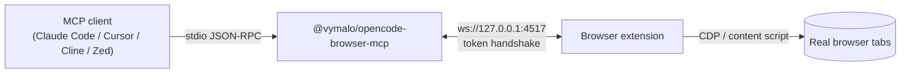

# @vymalo/opencode-browser-mcp

> Drive a real browser from **any MCP client** — Claude Code, Cursor, Cline, Zed, … — via the
> [`@vymalo/opencode-browser`](../opencode-browser) extension.

[](https://www.npmjs.com/package/@vymalo/opencode-browser-mcp)


An MCP **stdio server** that hosts the same localhost WebSocket **bridge** as the OpenCode
plugin and exposes the same `browser_*` tools (open, click, type, scroll, screenshot, snapshot,
…) over the Model Context Protocol. Screenshots come back as **inline image content**.

It isn't tied to OpenCode — the companion extension doesn't care which adapter is on the other
end of the bridge. The MCP server and the OpenCode plugin share **one tool catalog**, so the two
surfaces never drift.



## Setup (3 steps)

1. **Register the server** with your MCP client (snippets below).
2. **Load the extension** — see the [extension README](../../apps/browser-extension/README.md).
3. **Connect**: open the extension dashboard, paste the bridge URL (`ws://127.0.0.1:4517`) and the
   **same token** you set in `OCB_TOKEN` (if unset, the server prints a generated one to stderr).

### Claude Code

```sh
# Set the shared token up front (-e). Re-running `add` with the same name
# reports "Server already exists" — remove it first (claude mcp remove browser)
# if you need to change the env.
claude mcp add browser -e OCB_TOKEN=your-shared-token -- npx -y @vymalo/opencode-browser-mcp
```

Or edit `~/.claude.json` / project `.mcp.json` directly (same JSON shape as below).

### Cursor / Cline / Windsurf / Zed

Add to the client's MCP config (`~/.cursor/mcp.json`, Cline's `cline_mcp_settings.json`, Zed's
`settings.json` under `context_servers`, etc.):

```jsonc
{
  "mcpServers": {
    "browser": {
      "command": "npx",
      "args": ["-y", "@vymalo/opencode-browser-mcp"],
      "env": { "OCB_TOKEN": "your-shared-token", "OCB_GROUPS": "page,control" }
    }
  }
}
```

### Generic MCP client

Anything that speaks MCP over stdio works — run `npx -y @vymalo/opencode-browser-mcp` as the
server command. stdout is the JSON-RPC stream; **all logs go to stderr**.

## Environment

| Var | Default | Meaning |
| --- | --- | --- |
| `OCB_TOKEN` | _generated_ | Shared secret the extension must present (printed to stderr if unset). |
| `OCB_HOST` | `127.0.0.1` | Bridge bind host. Keep it loopback. |
| `OCB_PORT` | `4517` | Bridge port. |
| `OCB_GROUPS` | `page,control` | Tool groups to expose (`page` \| `control` \| `debug`, comma-separated). |

Set a **fixed** `OCB_TOKEN` so you don't have to re-copy a fresh one each launch — and so it
matches what you typed into the extension.

## Tools & groups

The same 33-tool surface as the plugin, partitioned into `page` (observe), `control` (drive), and
`debug` (powerful/sensitive, **off by default** — add `debug` to `OCB_GROUPS` to enable). Full
tool reference: [`packages/opencode-browser`](../opencode-browser#the-33-tools) and
[`docs/browser.md`](https://github.com/vymalo/opencode-oauth2/blob/main/docs/browser.md).

Screenshots are returned as inline MCP image content (no on-disk path step needed, unlike the
text-only OpenCode plugin).

## Sharing one bridge

The bridge is an auto-elect broker: you can run the MCP server **and** the OpenCode plugin (and
multiple editor sessions) against the same port — the first to bind hosts, the rest join as
guests, and tab groups stay owned by whoever created them. See
[`plans/multi-client-routing.md`](https://github.com/vymalo/opencode-oauth2/blob/main/plans/multi-client-routing.md).

## Troubleshooting

| Symptom | Fix |
| --- | --- |
| Client shows the server but no tools | Extension not connected — load it and paste URL + token. |
| Auth fails on connect | `OCB_TOKEN` ≠ the token in the extension dashboard. |
| "port in use" but tools still work | Another adapter already hosts the bridge; this server joined as a guest. Expected. |
| Logs polluting the protocol | They shouldn't — everything is on stderr. File a bug if stdout carries non-JSON-RPC. |

## Security

Loopback bind + token handshake; grants control of a real browser profile — **use a dedicated /
throwaway profile**. See [`docs/security.md`](https://github.com/vymalo/opencode-oauth2/blob/main/docs/security.md).

## License

[MIT](https://github.com/vymalo/opencode-oauth2/blob/main/LICENSE) © vymalo contributors
