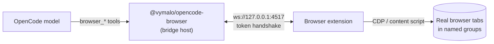

# @vymalo/opencode-browser

> Give an OpenCode agent hands in a real browser — open tabs, click, type, scroll, screenshot —
> organized into **named tab groups**.

[](https://www.npmjs.com/package/@vymalo/opencode-browser)


This is the **OpenCode plugin** half of a dual plugin. It registers `browser_*` tools the model
can call and hosts a localhost WebSocket **bridge**. A companion **browser extension**
(Chromium MV3 + Firefox) connects to the bridge and drives real tabs.

> Browser extensions can't host servers, so the plugin is the server and the extension dials
> out to it. The bridge is served with the `ws` package, which runs under both runtimes OpenCode
> uses — Bun (CLI / `opencode web`) and Node (the desktop app) — so it works in either.



## Table of contents

- [How it works](#how-it-works)
- [Install](#install)
- [Quickstart](#quickstart)
- [Options](#options)
- [The 33 tools](#the-33-tools)
- [Targeting elements](#targeting-elements--prefer-refs)
- [Screenshots](#screenshots)
- [Named groups](#named-groups)
- [Scoping tools and token cost](#scoping-tools-and-token-cost)
- [Multiple browsers & agents](#multiple-browsers--agents)
- [Executors: CDP vs content-script](#executors-cdp-vs-content-script)
- [Stopping / releasing control](#stopping--releasing-control)
- [Security](#security)
- [Troubleshooting](#troubleshooting)

## How it works

1. OpenCode loads the plugin; it binds a WebSocket bridge on `127.0.0.1:<port>` and prints a
   shared `token` (or uses the one you set).
2. You load the extension once, paste the bridge URL + token into its dashboard, and connect.
3. The model calls a `browser_*` tool → the plugin sends a command frame over the bridge → the
   extension executes it against a real tab → the result comes back to the model.

The extension and plugin agree on a small, dependency-free wire protocol; the same protocol is
mirrored into the extension so the two never drift.

## Install

```jsonc
// opencode.json
{
  "$schema": "https://opencode.ai/config.json",
  "plugin": [["@vymalo/opencode-browser", { "port": 4517 }]]
}
```

On first run with no `token`, the plugin generates one and logs it once
(`browser_bridge_token_generated`). Paste that into the extension's dashboard along with the
bridge URL (`ws://127.0.0.1:4517`).

Get the extension from the [Releases page](https://github.com/vymalo/opencode-oauth2/releases)
(`opencode-browser-extension-<version>-chrome.zip` / `-firefox.zip`), from the Chrome Web Store /
Firefox Add-ons, or build it from
[`apps/browser-extension`](https://github.com/vymalo/opencode-oauth2/tree/main/apps/browser-extension).

## Quickstart

A typical first session, end to end:

```text
You:    Open example.com in a group called "research" and tell me the page heading.
Model:  browser_open({ group: "research", url: "https://example.com" })
        browser_snapshot({ group: "research" })          → refs e1, e2, …
        browser_get_text({ group: "research" })
        → "Example Domain — This domain is for use in illustrative examples…"

You:    Screenshot it.
Model:  browser_screenshot({ group: "research", fullPage: true })
        → "Saved screenshot to .opencode/browser/research/2026-…png (1280×3200)."
        (the model then reads that file to see it)
```

A titled **tab group** named "research" appears in the browser; the extension dashboard logs
every action and keeps a screenshot gallery.

## Options

Second argument to the plugin tuple in `opencode.json`:

| Option | Default | Meaning |
| --- | --- | --- |
| `enabled` | `true` | Master switch. |
| `host` | `"127.0.0.1"` | Bind interface. **Keep it loopback** — see [Security](#security). |
| `port` | `4517` | Bridge port. |
| `token` | _generated_ | Shared secret the extension must present. Empty string ⇒ generated + logged. |
| `groups` | `["page","control"]` | Tool groups to register (`page` \| `control` \| `debug`). |
| `executor` | `"auto"` | `auto` \| `cdp` \| `content` — forwarded to the extension as a preference. |
| `timeoutMs` | `30000` | Per-command timeout. |
| `screenshotDir` | `".opencode/browser"` | Screenshot output dir (relative → resolved against the worktree). |

## The 33 tools

Names are stable `browser_*` identifiers, partitioned into three **groups** gated by the
`groups` option. Every tool takes a `group` (the named tab group) unless noted.

### `page` — observe (8, default on)

| Tool | Key args | Does |
| --- | --- | --- |
| `browser_snapshot` | `group` | Accessibility/DOM outline with stable **refs** the other tools target. Start here. |
| `browser_get_text` | `group, tabId?` | Visible/readable text of the active tab. |
| `browser_get_html` | `group, ref?/selector?, outer?` | HTML of an element or the document. |
| `browser_get_attribute` | `group, ref?/selector, name?` | Tag, text, value, and attributes of an element. |
| `browser_query` | `group, selector, limit?` | Match a CSS selector → list of elements with fresh refs. |
| `browser_tabs` | `group?` | List groups and their tabs. Omit `group` for everything you own. |
| `browser_targets` | — | List connected browsers (for multi-browser routing). |
| `browser_screenshot` | `group, fullPage?, tabId?` | PNG to disk; returns the path. See [Screenshots](#screenshots). |

### `control` — drive (19, default on)

| Tool | Key args | Does |
| --- | --- | --- |
| `browser_open` | `group, url?, focus?, target?` | Open a tab in the group (creates the group on first use). |
| `browser_navigate` | `group, url, tabId?` | Navigate an existing tab. |
| `browser_back` / `browser_forward` / `browser_reload` | `group, tabId?` | History / reload. |
| `browser_activate` | `group, tabId?` | Bring a tab to the foreground. |
| `browser_click` | `group, ref?/selector?/x?,y?, button?` | Click an element or coordinates. |
| `browser_double_click` | `group, ref?/selector?/x?,y?` | Double-click. |
| `browser_hover` | `group, ref?/selector?/x?,y?` | Hover. |
| `browser_drag` | `group, fromRef?/fromSelector?, ref?/selector?` | Drag source → target. |
| `browser_type` | `group, text, ref?/selector?, submit?` | Type into a field (optionally press Enter). |
| `browser_fill` | `group, fields:[{ref?/selector,value}]` | Batch-fill several fields. |
| `browser_select` | `group, ref?/selector, value?/values?` | Choose `<select>` option(s). |
| `browser_press_key` | `group, key` | Press a key or chord (`"Enter"`, `"Control+a"`). |
| `browser_scroll` | `group, deltaX?, deltaY?, ref?, to?` | Scroll the page or an element. |
| `browser_upload` | `group, ref?/selector, paths:[…]` | Attach file(s) to a file input (CDP/Chromium). |
| `browser_wait` | `group, ms?/selector?, state?` | Wait a fixed delay or for a selector. |
| `browser_close` | `group, tabId?` | Close a tab, or the whole group if `tabId` omitted. |
| `browser_release` | `group?` | Hand the browser back (detach CDP) without closing tabs. |

### `debug` — powerful / sensitive (6, **off by default**)

Enable with `{ "groups": ["page","control","debug"] }`.

| Tool | Key args | Does |
| --- | --- | --- |
| `browser_eval` | `group, code, tabId?` | Evaluate arbitrary JavaScript in the page. |
| `browser_console` | `group` | Recent console messages. |
| `browser_network` | `group` | Recent network requests. |
| `browser_handle_dialog` | `group, accept?, promptText?` | Accept/dismiss a native `alert`/`confirm`/`prompt`. |
| `browser_set_viewport` | `group, width, height, mobile?, deviceScaleFactor?` | Emulate a viewport (CDP/Chromium only). |
| `browser_cookies` | `op, url?, name?, …` | Get/list/set/clear cookies (profile-wide). |

## Targeting elements — prefer refs

Two ways to address an element:

- **By ref (recommended)** — call `browser_snapshot` (or `browser_query`), get back stable refs
  like `e1`, `e2`, then `browser_click({ group, ref: "e3" })`. Refs survive minor layout shifts
  and are far more reliable than brittle selectors.
- **By CSS selector or coordinates** — `selector: "#login"` or `x`/`y`. Useful for canvases,
  maps, and elements a snapshot doesn't expose.

## Screenshots

OpenCode tool output is **text-only** — it can't carry an image. So the plugin writes the PNG to
`<screenshotDir>/<group>/<timestamp>.png` and returns the path; the model then opens it with
OpenCode's built-in `read` tool (which renders images). `fullPage: true` captures the whole
scrollable page (CDP `captureBeyondViewport` on Chromium; scroll-and-stitch on the content
executor). The extension also keeps a copy in its dashboard gallery.

> Driving from a non-OpenCode MCP client instead? `@vymalo/opencode-browser-mcp` returns
> screenshots as **inline images** (MCP can carry them).

## Named groups

Every action targets a **group** — a named bucket of tabs the agent created. On Chromium groups
map to real `chrome.tabGroups` (titled, colored); on Firefox they're a logical registry. Groups
keep each task's tabs isolated and inspectable, and are the unit of ownership when multiple
agents share one bridge.

## Scoping tools and token cost

Two levers, and they compose:

- **`groups` (global)** — which tools are *registered* at all. The ceiling: an agent can only ever
  be granted tools that are registered.
- **Per-agent `permission` (per agent)** — which registered tools each agent actually gets. **In
  the flat string form this trims the agent's injected tool list, so it genuinely cuts context
  tokens** — not just execution.

Approximate context cost of the full surface (tool name + description + args JSON schema the model
sees — rough, ≈chars/4):

| Registered `groups` | Tools | ≈ tokens (an agent granted all of them) |
| --- | --- | --- |
| `["page"]` | 8 | ~1,000 |
| `["page","control"]` *(default)* | 27 | ~3,700 |
| `["page","control","debug"]` | 33 | ~4,560 |
| `debug` adds | 6 | ~830 |

> ### ⚠️ Flat string vs nested — the token footgun
> Per-agent scoping only reclaims tokens in the **flat string** `permission` form. The other forms
> gate *execution* but still inject the schema (so they flood context):
>
> | Form | Example | Trims context? |
> | --- | --- | --- |
> | flat string `permission` | `"browser_eval": "deny"` | ✅ removed from the agent's tools |
> | nested `permission` | `"browser_eval": { "*": "deny" }` | ❌ execution gate only |
> | `tools` map (deprecated) | `"browser_eval": false` (≡ nested `{"*":"deny"}`) | ❌ execution gate only |
>
> Verified on OpenCode **1.17.6** — confirm on your version by checking an agent's actual context
> token count with tools denied. (This is exactly the trap behind "registering a group floods every
> agent": that observation comes from the `tools`-boolean / nested form.)

### Recommended: register everything, scope per agent

If your org wants the full surface available but **not** flooding every agent's context, register
all groups once and give each agent only the tools it needs with **flat string** `permission`:

```jsonc
{
  // full surface registered once — global
  "plugin": [["@vymalo/opencode-browser", { "groups": ["page", "control", "debug"] }]],
  "agent": {
    "researcher": {
      // FLAT STRING form → denied tools are dropped from this agent's injected
      // tools, so its context carries only the allowed ones.
      "permission": {
        "browser_*": "deny",          // start from nothing…
        "browser_open": "allow",      // …allow only what this agent needs
        "browser_navigate": "allow",
        "browser_snapshot": "allow",
        "browser_get_text": "allow",
        "browser_query": "allow",
        "browser_screenshot": "allow"
      }
    },
    "automator": { "permission": { "browser_*": "allow" } }   // full drive
  }
}
```

(Specific keys override the `browser_*` wildcard. If you'd rather not rely on that precedence,
list explicit `"deny"`s for the tools an agent shouldn't have instead of a wildcard.)

If you don't need per-agent differences, just register the minimum union globally — `["page"]` for
read-only research, `["page","control"]` to drive — and skip `debug` unless a workflow needs
`eval`/`cookies`/`network`. Either way the schemas sit in the cached prefix, so prompt caching
softens the per-request **dollar** cost; trimming still helps the context window and cache writes.
See OpenCode's [agent docs](https://opencode.ai/docs/agents/) for the `permission` field.

## Multiple browsers & agents

The bridge is an **auto-elect broker**: multiple agents (plugin, MCP, sessions) and multiple
executors (browsers) can share one bridge. The first process to bind the port becomes the host;
others join as guests. Groups are owned by the agent that created them (owner-exclusive), and
ownership is rebuilt automatically on failover. Use `browser_targets` to see connected browsers
and `browser_open({ target })` to pick one. Full design:
[`plans/multi-client-routing.md`](https://github.com/vymalo/opencode-oauth2/blob/main/plans/multi-client-routing.md).

## Executors: CDP vs content-script

- **CDP executor** (`chrome.debugger`, Chromium) — trusted input, full-page capture, console &
  network logs. Shows Chrome's "being debugged" banner — an intentional signal.
- **Content-script executor** — synthetic events + `captureVisibleTab`; the Firefox-safe
  fallback, also used when the debugger is unavailable.

`executor: "auto"` picks CDP on Chromium when the `debugger` permission is granted, else the
content script. Force one with `"cdp"` / `"content"`.

## Stopping / releasing control

Control is **plugin-managed** — you never disconnect by hand. It's released when:

- the model/plugin calls **`browser_release`** (mid-session), or
- **OpenCode exits** — the plugin's `exit` hook shuts the bridge down, and the dropped socket
  independently makes the extension release. A hard kill releases too.

## Security

The bridge binds `127.0.0.1` only and requires a token handshake. It grants the model control of
a **real browser profile** — **use a dedicated or throwaway Chrome profile**, not your daily one.
The `chrome.debugger` banner is a deliberate, continuous indicator that automation is active.
`debug` tools (`browser_eval`, `browser_cookies`, …) are off by default for this reason. See the
consolidated [`docs/security.md`](https://github.com/vymalo/opencode-oauth2/blob/main/docs/security.md).

## Troubleshooting

| Symptom | Likely cause |
| --- | --- |
| Extension won't connect | URL/token mismatch, or another process already on the port. Re-copy the logged token. |
| "being debugged" banner stays after a session | Normal until release; `browser_release` or exiting OpenCode clears it. |
| `set_viewport` / full-page differs on Firefox | CDP-only features; Firefox uses the content executor. |
| Screenshot path returned but model "can't see" it | The model must `read` the path — output is text-only. |

Symptom-keyed fixes: [`docs/troubleshooting.md`](https://github.com/vymalo/opencode-oauth2/blob/main/docs/troubleshooting.md).
Full architecture, wire protocol, and tool reference: [`docs/browser.md`](https://github.com/vymalo/opencode-oauth2/blob/main/docs/browser.md).

## License

[MIT](https://github.com/vymalo/opencode-oauth2/blob/main/LICENSE) © vymalo contributors
